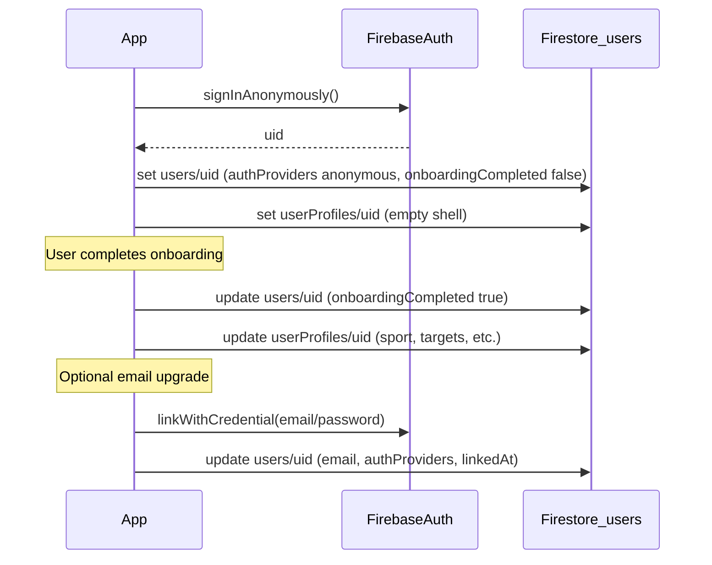

# Firestore: `users/{uid}`

Account record tied to Firebase Auth. Document ID **must equal** `request.auth.uid`.

## Fields

| Field | Type | Required | Description |
|-------|------|----------|-------------|
| `uid` | string | yes | Same as document ID |
| `authProviders` | array&lt;string&gt; | yes | e.g. `["anonymous"]`, later `["password"]` |
| `email` | string \| null | no | `null` until email is linked |
| `emailVerified` | boolean | yes | Default `false` |
| `displayName` | string \| null | no | Optional account-level display name |
| `accountStatus` | string | yes | `active` \| `disabled` \| `deleted` |
| `onboardingCompleted` | boolean | yes | Routes app shell vs onboarding |
| `createdAt` | timestamp | yes | Server/client timestamp on create |
| `updatedAt` | timestamp | yes | Updated on any account change |
| `lastSeenAt` | timestamp | no | Optional engagement metric |
| `linkedAt` | timestamp \| null | no | When anonymous user linked email |

## Anonymous-first lifecycle



### 1. Anonymous sign-in

```dart
final account = await userRepository.signInAnonymously(
  timezone: 'America/Los_Angeles',
);
```

Creates:

```json
{
  "uid": "<auth-uid>",
  "authProviders": ["anonymous"],
  "email": null,
  "emailVerified": false,
  "displayName": null,
  "accountStatus": "active",
  "onboardingCompleted": false,
  "createdAt": "<timestamp>",
  "updatedAt": "<timestamp>",
  "linkedAt": null
}
```

### 2. Onboarding complete

Updates `onboardingCompleted: true` on `users/{uid}` (see [`user-profiles-collection.md`](user-profiles-collection.md)).

### 3. Link email (anonymous → registered)

```dart
final account = await userRepository.linkEmail(
  uid: uid,
  email: 'athlete@school.edu',
  password: '<secure-password>',
);
```

- Auth: `User.linkWithCredential(EmailAuthProvider.credential(...))`
- Firestore: set `email`, append `password` to `authProviders`, set `linkedAt`, `updatedAt`

Preserves the same `uid` so existing `userProfiles/{uid}` data remains.

## Dart model

[`lib/models/user_account.dart`](../../lib/models/user_account.dart) — `UserAccount`, `AccountStatus`

## Repository

[`lib/services/firestore_user_repository.dart`](../../lib/services/firestore_user_repository.dart) — `signInAnonymously`, `linkEmail`, `saveAccount`
